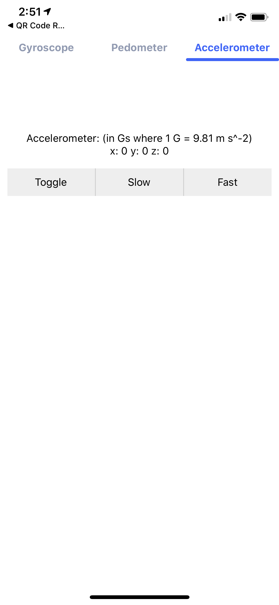
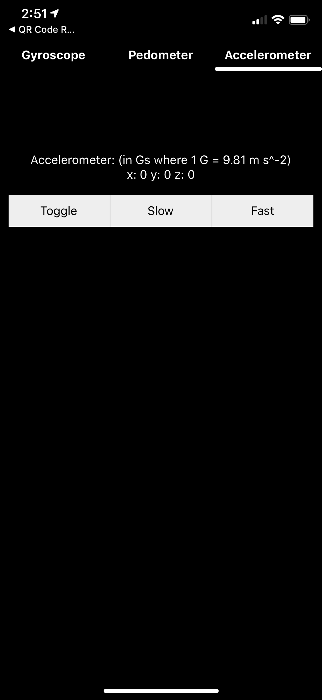
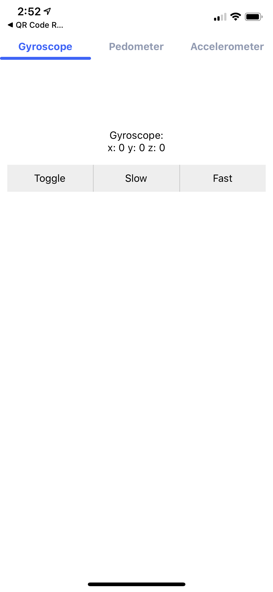
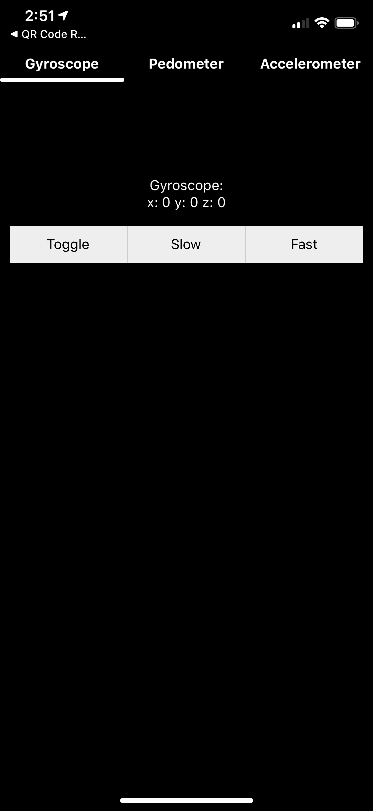
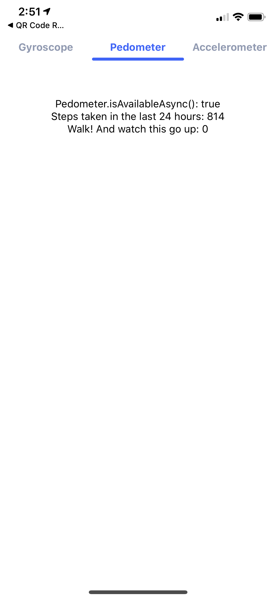
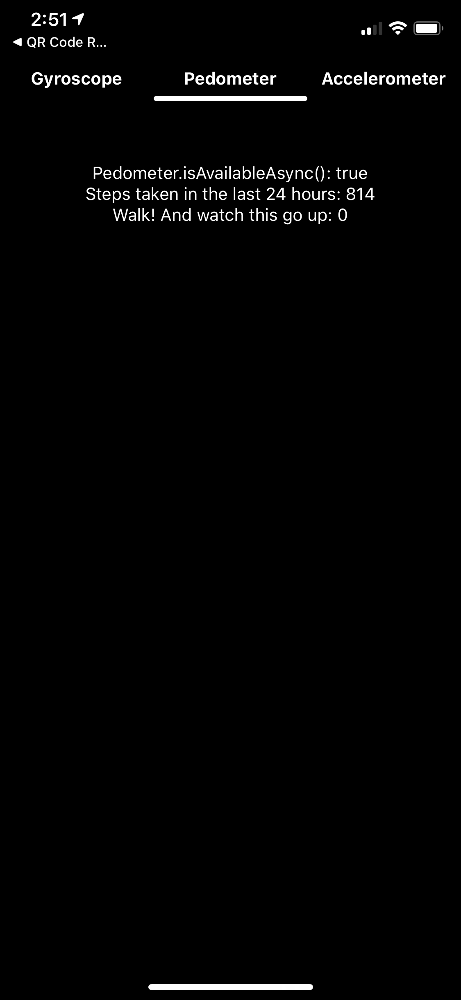

# Sensor App

    

## Description

An app that allows users to explore the various sensors built into a modern smartphone

## Features

- Gyroscope
- Accelerometer
- Pedometer
- Barometer
- Dark mode/Light mode based on system settings

## Coming Soon

- Speedometer
- Improved UI

## Images

